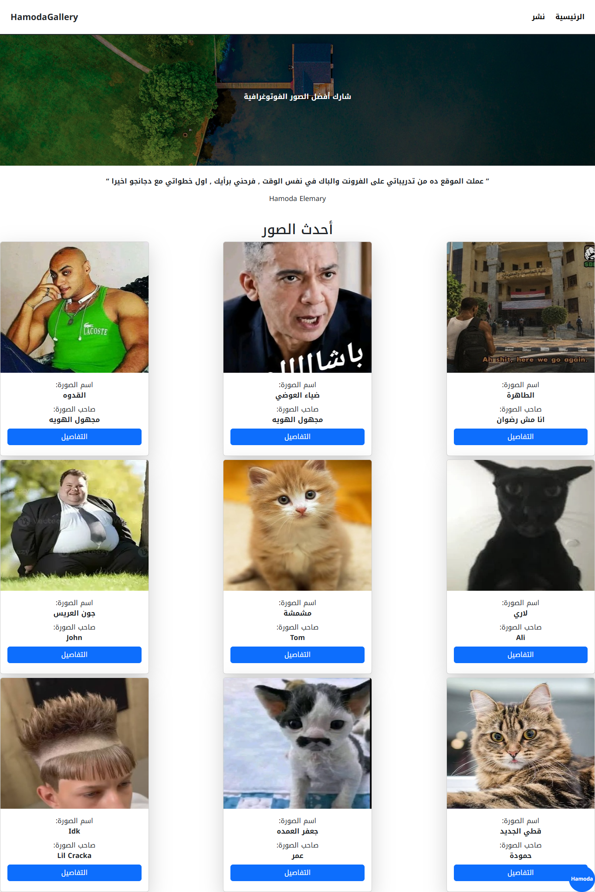

# HamodaGallery
Html css js jquery bootstrap Django sqlite

>py -m django startproject mysite .

I have used html css js bootstrap jquery django to make this project
 
<a href='https://hamodagallery.up.railway.app/'>Try My Web App</a>
 
<a href='https://github.com/hemoelemary/HamodaGallery'>Github Repo</a>
 
Day 1: I focused entirely on the front-end, adding smooth animations and transitions, and optimizing the responsive design using Bootstrap breakpoints.

Day 2 (Today): This was all about building with Django from scratch. It was honestly a great experience working with Class-Based Views, especially Generic Views.
mobile

 
desktop

